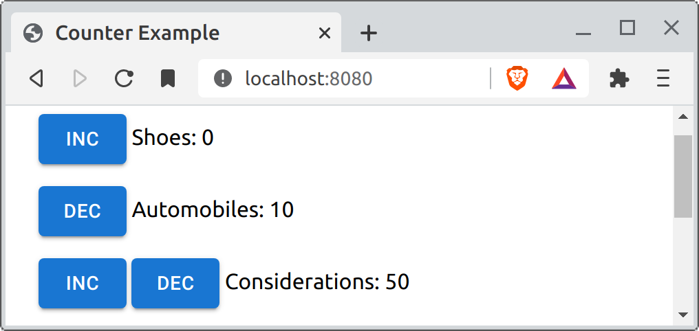

# [React-mvc-lite](https://github.com/zot/react-mvc-lite): A simple, fine-grained MVC approach for React

## Intro

Fine-grained MVC can provide unparalleled flexibility and dynamism
since it relies on object oriented message dispatching to render
components and it can also help with robustness (more modular code,
less case logic). This tiny project implements MVC in React in an
extremely simple way with ***very low overhead*** and ***very low
boilerplate***.

To use this package, you just define model classes with rendering
methods. If you want or need a strict separation of presentation and
domain, you can make separate view classes but you'll have provide a
way to bridge from the models to the views. When it's practical, I
advocate just putting the rendering methods in the models.

The MVC pattern was originally created in the 70s, for Smalltalk. The
[paper](https://www.ics.uci.edu/~redmiles/ics227-SQ04/papers/KrasnerPope88.pdf)
was published in 1988. There are several MVC approaches out there for
doing MVC in React but my goal here is to provide ***lightweight***,
***low boilerplate***, ***fine-grained*** MVC for React.

Here's the general idea of MVC (courtesy of Wikimedia):

<a href="https://en.wikipedia.org/wiki/File:MVC-Process.svg"></a>

Web apps use this approach today but to many developers, the "view" is
simply the *entire web page*. The controller processes the web request
and consults models in the back-end to build the "view". This pattern
works well but many apps could benefit from a finer-grained approach.

In Smalltalk, each widget has a model, view, and controller. This
includes text fields, lists, buttons, menus, items in menus, and so
on. The model for a text field holds a string and when the model
changes, it automatically updates its view (the text field). Also, in
Smalltalk, views contain views. What we think of today as "widgets",
are views in Smalltalk, in the MVC sense.

So, instead of leaving web apps at a bulk approach, with only one
view, the frontend can be comprised of many models, views, and
controllers.  This captures more of the original intent, flexibility,
and power of the MVC paradigm (see the paper for details).

Normally, in a React app, you make components for data you want to
render and each component references components for the data it uses
directly, "inlining" them, so to speak.

## Example

You can see the example in action [here](https://zot.github.io/react-mvc-lite), by the way.

For this example, we'll use 3 types of counters: IncrementingCounter,
DecrementingCounter, and IncDecCounter. The three counters really only
differ in how they render (what buttons and how many of them) but in real
life cases, the different objects would also vary in properties and behavior.



*By the way, I do realize that my example is also a counter example.*

For the inlining example, we end up with something like this:

```typescript
function InlineCounters() {
    return (
        <>
            {counterList.map((c, i)=> <InlineCounter counter={c} i={i}/>)}
        </>
    )
}

function InlineCounter({i, counter: c}: {i: number, counter: Counter}) {
    const [value, setValue] = useState(c.value)

    return (
        <div className='mb-4' key={`inline-${i}`}>
            {c.hasInc ?
                <Button
                    variant='contained'
                    onClick={()=>{c.value++; setValue(c.value)}}>
                    Inc
                </Button>
                : <></>}
            {c.hasInc && c.hasDec ? <>&nbsp;</> : <></>}
            {c.hasDec ?
                <Button
                    variant='contained'
                    onClick={()=>{c.value--; setValue(c.value)}}>
                    Dec
                </Button>
                : <></>}
            &nbsp;
            {c.name}: {c.value}
        </div>)

}
```

There's nothing wrong with this approach and in many cases, this is
more practical and simpler than defining classes to represent
different configurations. The approach, however, is not very "OO"; it
uses case logic that you could avoid by using methods, maybe by
defining `renderInc()` and `renderDec()`. The fundamental structure
along with the state mangament, however, is in the InlineCounter
function. This means the counters aren't in charge of their own state
-- even if you provided `renderInc()` and `renderDec()`, they couldn't
call `useState()` except in very limited ways. If some counters, for
example, allow editing their name, they would need state for that but
others would not need it.

It takes a little discernment to decide whether it's fitting to make
different classes for your model. When you need to, you can step out
of "inline" mode and go into "MVC" mode. In MVC, different kinds of
models have different kinds of views in ***different situations*** and
there should be a straightforward way to choose the view for your
model, like by just asking the model to render itself. A model could
render itself differently depending on whether you're presenting an
editor, a list element, or a select item for it.

Here's what `Counters()` looks like, an MVC version of
`InlineCounters()`. By calling `c.renderEditor()`, we let the model
decide how to render itself.

```typescript
function Counters() {
    return (
        <>
            {counterList.map((c, i)=> c.renderEditor(i))}
        </>
    )
}
```

The `renderEditor()` method does have to use a *tiny bit* of ceremony
in order to interact properly with React because when you need to mange state, you have to 
use a component; methods aren't React components.

```typescript
renderEditor(index: number) {
    return (<Render key={`inc-${index}`} render={()=> {
        const controller = control(this, 'name', 'value')

        console.log('render', this)
        return (
            <div className='mb-4'>
                <Button
                    variant='contained'
                    onClick={controller(()=> this.value++)}>
                    Inc
                </Button>
                &nbsp;
                {this.name}: {this.value}
            </div>
        )
    }}/>)
}
```

The `Render` component provides a way to manage state from a method,
it simply delegates rendering to the function you give it. The
`checkState` function captures the state of the model -- it uses
`deepEqual` to detect state changes so you can give it properties that
contain structured data.

The controller is a function returned from the `control()` function,
which also captures the state of the model. In Smalltalk's MVC,
controllers process input events, so this is an analgous technique --
if your event handling is complex, you can gather it all into one
place instead of just using expressions like I do in the example.

## Using this in your code

So, that's it. Just use define your model and add rendering methods
that use `<Render>` and `controller()`.

# Building the example

- build the dist directory with `npm run dist`
- run a webpack server with `npm run http`
